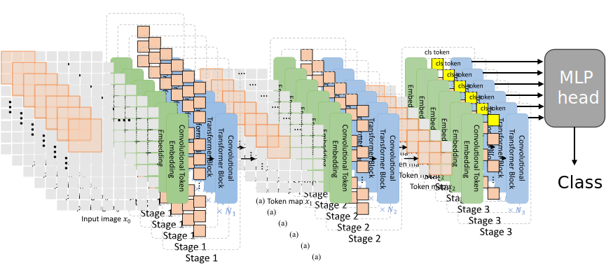

# 訓練結果
將彎舉及側平舉數據轉為Mel頻譜後輸入我們的多圖CvT模型進行訓練

10個epoch下最終準確率達到100%；
使用RTX2070花費2.2小時

[tensorboard記錄檔](./OUTPUT/multidim_imagenet/cvt-dim6-310x321/events.out.tfevents.1739264799.DESKTOP-9T3F3EH)

[log記錄檔(包含參數設定、模型架構、訓練過程](./OUTPUT/multidim_imagenet/cvt-dim6-310x321/train_2025-02-11-17-05_rank0.txt)


# 多視圖融合 CvT
>多圖融合 Convolutional Vision Transformer (CvT) 是在原始 CvT 基礎上，透過 MergeAttention 模組進一步支援 多視圖 (multi-view) 圖像輸入，使其能夠同時處理 6 張影像，並透過注意力機制進行特徵融合，最終進行分類。
## 原先的CvT

## 修改後的多視圖CvT

## 模型架構
[主要修改為cls_cvt.py](./lib/models/cls_cvt.py) 

將原先的輸入維度[B, 3, H, W] 改為 [B, D, 3, H, W] ，其中D為維度以用作多圖輸入。

此版本的 CvT 主要新增 多視圖特徵融合 `MergeAttention`，與原本 CvT 的 VisionTransformer `VisionTransformer` 結合。

### (1) 原有的VisionTransformer `VisionTransformer`
採用 卷積嵌入 `ConvEmbed` 來取代標準 ViT 的 Patch Embedding，保留局部空間資訊。

透過 多層 Transformer Block `Block` 提取深度特徵，每個 Block 內部包含 自注意力 `Attention` 與 MLP `Mlp`。

透過 `cls_token` 或 `avg_pooling` 提取全局特徵。

### (2) 新增部分：多視圖特徵融合 `MergeAttention`

多視圖特徵融合 `MergeAttention` 的核心目標是將來自多張不同視角的影像特徵 進行整合，獲取更具全局性的影像表示。其關鍵作法如下：

- 多頭自注意力 `Multihead Self-Attention`
  - 透過 `nn.MultiheadAttention` 計算 不同視角間的注意力權重。
  - 讓來自不同視角的特徵可以互相參考，學習它們之間的關聯性。
  - 設定 embed_dim 作為特徵維度，num_heads 決定注意力頭的數量，以提升模型的特徵學習能力。

- 殘差連接 (Residual Connection) 與 LayerNorm
  - 殘差連接：將 MultiheadAttention 的輸出 (attn_out) 與輸入 x 相加 (x = x + attn_out)，以保留原始特徵資訊。
  -LayerNorm：對殘差輸出進行標準化 (self.norm(x))，穩定訓練過程，減少梯度消失或梯度爆炸的風險。

- 特徵聚合 (Feature Aggregation) - 平均池化 (Mean Pooling) 降維
  - 關鍵步驟：將 [B, 6, D] 轉換為 [B, D]
  - 其中 6 代表 6 個不同視角的特徵。
  - 透過 平均池化 (Mean Pooling) (x.mean(dim=1))，對 6 個視角的特徵進行平均，得到融合後的全局影像表示 [B, D]。

>總結
>多頭自注意力 幫助學習來自不同視角的特徵關聯。
>殘差連接與 LayerNorm 穩定訓練並保留關鍵資訊。
>平均池化降維 提取整體影像的全局特徵。
>MergeAttention 的關鍵步驟是 將 [B, 6, D] 轉換為 ****************``，這裡使用平均池化接對 6 視角的徵取平均

### (3) 多圖融合 Convolutional Vision Transformer `ConvolutionalVisionTransformer`

整合 `VisionTransformer` 和 `MergeAttention`，使其支援 6 張圖像輸入。

前向傳播 `forward` 流程：

將 6 張影像 各自送入 VisionTransformer，獲得 6 個特徵向量 [B, D]。

透過 MergeAttention，將 [B, 6, D] 轉換為 [B, D]，獲得全局特徵。

最終透過線性分類器 `self.head` 進行分類。

>主要新增模組解析
>
>`MergeAttention`將 6 張圖的特徵 [B, 6, D] 合併為 [B, D]。
>核心技術：多頭自注意力 `MultiheadAttention`。
>
>透過 自注意力機制，學習來自不同視角影像的特徵關聯性。
>
>透過殘差連接與正規化 `LayerNorm` 確保穩定性。
>
>最終透過 mean(dim=1) 平均池化聚合視角特徵，形成最終輸出。
>
>修改後的 Convolutional Vision Transformer `ConvolutionalVisionTransformer`
>
>讓 VisionTransformer 支援 多視圖輸入。
>
>透過 MergeAttention 融合 6 張影像的特徵，再進行分類。

# 讀取檔案及訓練資料集架構
為了進行相應的數據讀取也修改了相應的[檔案](./lib/dataset/build.py) ，
當 DATASET.DATASET 為'multidim_imagenet' 時便使用修改的多圖讀取的方法；為原來的'imagenet'時則使用完來的方法

檔案資料夾架構也由原先每個class裡直接放圖片，修改成每個class下有不同的dim，每個 dim 內部包含多張圖片 (0.jpg ~ n.jpg)
``` sh
|-DATASET
  |-imagenet
    |-train
    | |-class1
    | | |-img1.jpg
    | | |-img2.jpg
    | | |-...
    | |-class2
    | | |-img3.jpg
    | | |-...
    | |-class3
    | | |-img4.jpg
    | | |-...
    | |-...
    |-val
      |-class1
      | |-img5.jpg
      | |-...
      |-class2
      | |-img6.jpg
      | |-...
      |-class3
      | |-img7.jpg
      | |-...
      |-...
```

改為
``` sh
DATASET/agmel/
├── train
│    ├── class1
│    │    └── dim1
│    │        ├── 0.jpg
│    │        ├── 1.jpg
│    │        ├── ...
│    │        ├── n.jpg
│    │    └── dim2
│    │        ├── 0.jpg
│    │        ├── 1.jpg
│    │        ├── ...
│    │        ├── n.jpg
│    │    └── dim3, dim4, ..., dim6
│    ├── class2
│    │    └── dim1, dim2, ..., dim6
│    └── ...
└── val
     ├── class1
     │    └── dim1, dim2, ..., dim6
     └── class2
          └── dim1, dim2, ..., dim6
```

[梅爾頻譜相關文件可以從這裡生成](./舉重/dataagmel.py) 

主要是把每個舉重動作分段再插植後再生成梅爾頻譜


# 環境架設及使用
## 整體環境是使用WSL Ubuntu20.04/ miniconda/ Torch 1.7.1 + CUDA11/
## conda
minaconda 安裝  https://docs.anaconda.com/miniconda/install/#quick-command-line-install
```sh
mkdir -p ~/miniconda3
wget https://repo.anaconda.com/miniconda/Miniconda3-latest-Linux-x86_64.sh -O ~/miniconda3/miniconda.sh
bash ~/miniconda3/miniconda.sh -b -u -p ~/miniconda3
rm ~/miniconda3/miniconda.sh
```

conda 常用指令
```sh
conda create -n CvT python=3.9
source ~/miniconda3/bin/activate
conda activate CvT
conda deactivate
```
```sh
python3 -m pip install -r requirements.txt
```

## git&linux (for me 常用指令)
```sh
git remote set-url origin https://github.com/violetzu/CvT.git
git config user.email "liuzii706@gmail.com"
git config user.name "violetzu"
```
```sh
rm -rf ~/miniconda3 (-rf 用作移除目錄及檔案)
source ~/.bashrc
tensorboard --logdir=OUTPUT/imagenet/cvt-13-224x224/
```

## CvT腳本指令
```sh
Usage: run.sh [run_options]
Options:
  -g|--gpus <1> - number of gpus to be used
  -t|--job-type <aml> - job type (train|test)
  -p|--port <9000> - master port
  -i|--install-deps - If install dependencies (default: False)
```
訓練腳本使用範例
```sh
bash run.sh -g 1 -t train --cfg experiments/imagenet/cvt/cvt-13-224x224.yaml
bash run.sh -g 1 -t train --cfg experiments/imagenet/cvt/cvt-dim6-310x321.yaml
```
tensorboard
```sh
tensorboard --logdir=<包含這個檔案的資料夾>
==
tensorboard --logdir=OUTPUT/multidim_imagenet/cvt-dim6-310x321
```
測試腳本使用範例
```sh
export PRETRAINED_MODEL_FILE=/home/st424/CvT/OUTPUT/imagenet/cvt-13-224x224/model_best.pth
bash run.sh -t test --cfg experiments/imagenet/cvt/cvt-13-224x224.yaml TEST.MODEL_FILE ${PRETRAINED_MODLE_FILE}
==
bash run.sh -t test --cfg experiments/imagenet/cvt/cvt-13-224x224.yaml TEST.MODEL_FILE /home/st424/CvT/OUTPUT/imagenet/cvt-13-224x224/model_best.pth

```

## Ubuntu20.04 gcc版本不足
```sh
strings /usr/lib/x86_64-linux-gnu/libstdc++.so.6 | grep GLIBCXX
``` 

結果未有3.4.25 則執行:
```sh
sudo apt install gcc-11 g++-11
``` 

未有gcc-11 g++-11:
添加PPA 
```sh
sudo add-apt-repository ppa:ubuntu-toolchain-r/test
sudo apt update
```

## Torch 1.7.1 +CUDA11
```sh
pip install torch==1.7.1+cu110 torchvision==0.8.2+cu110 -f https://download.pytorch.org/whl/torch_stable.html
```
確認pytorch可使用CUDA
```sh
python3 -c "import torch; print(torch.cuda.is_available())"
```


## CUDA 11.0 for Ubuntu20.04
https://developer.nvidia.com/cuda-11.0-download-archive?target_os=Linux&target_arch=x86_64&target_distro=Ubuntu&target_version=2004&target_type=deblocal
```sh
wget https://developer.download.nvidia.com/compute/cuda/repos/ubuntu2004/x86_64/cuda-ubuntu2004.pin
sudo mv cuda-ubuntu2004.pin /etc/apt/preferences.d/cuda-repository-pin-600
wget http://developer.download.nvidia.com/compute/cuda/11.0.2/local_installers/cuda-repo-ubuntu2004-11-0-local_11.0.2-450.51.05-1_amd64.deb
sudo dpkg -i cuda-repo-ubuntu2004-11-0-local_11.0.2-450.51.05-1_amd64.deb
sudo apt-key add /var/cuda-repo-ubuntu2004-11-0-local/7fa2af80.pub
sudo apt-get update
sudo apt-get -y install cuda
```
```sh
nvcc --version
```
如果目前指向的是舊版本的 CUDA，請執行以下命令更新環境變數：
```sh
export PATH=/usr/local/cuda-11.0/bin:$PATH
export LD_LIBRARY_PATH=/usr/local/cuda-11.0/lib64:$LD_LIBRARY_PATH
```

永久更新環境變數
如果你希望每次啟動時自動加載 CUDA 11.0，可以將上述環境變數加入到 ~/.bashrc：
```sh
echo 'export PATH=/usr/local/cuda-11.0/bin:$PATH' >> ~/.bashrc
echo 'export LD_LIBRARY_PATH=/usr/local/cuda-11.0/lib64:$LD_LIBRARY_PATH' >> ~/.bashrc
source ~/.bashrc
```


## 筆記指令 for me
markdown preview快捷鍵
ctrl-shift-v

使用 pipreqs生成實際用到的 requirements.txt

假设你的项目目录是 my_project，运行以下命令：
这将在项目目录下生成一个只包含实际导入包的 requirements.txt。
如果你希望覆盖现有的 requirements.txt，可以加上 --force：
```sh
pipreqs /path/to/your/project --force
```
```sh
pip install jupyter pipreqs
```
```sh
jupyter nbconvert --to script your_notebook.ipynb
```


